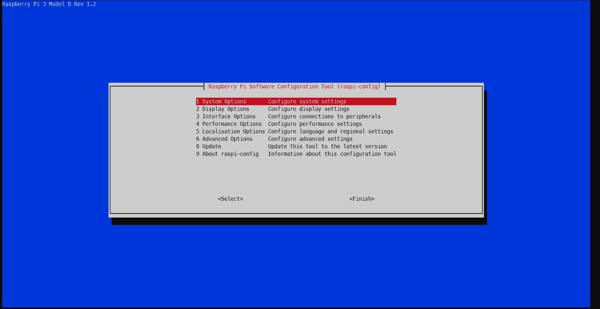
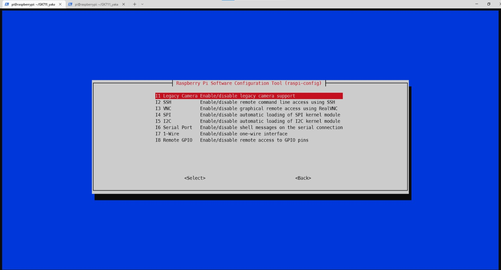
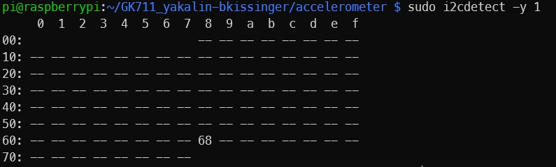
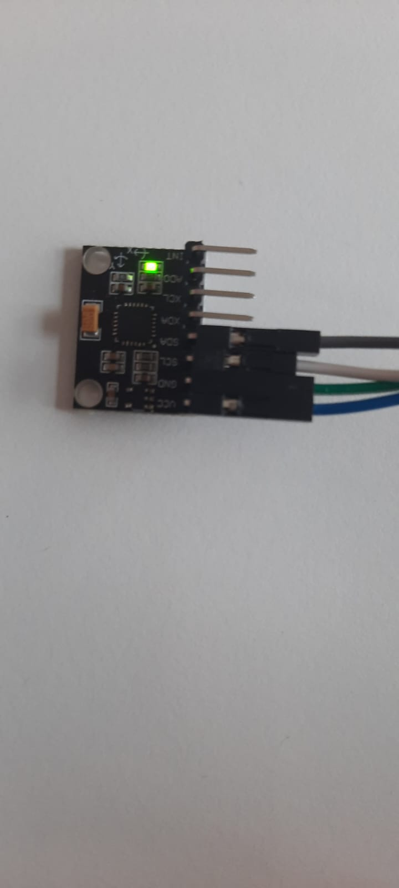
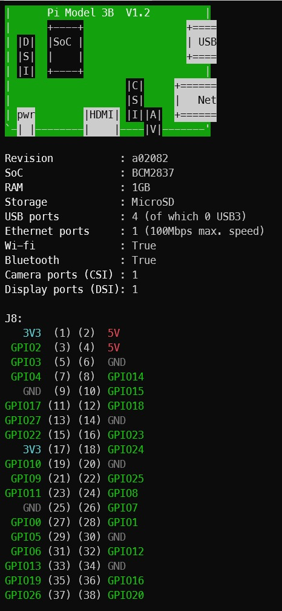

# GK711 Embedded Devices "Anzeige und Analyse von Sensordaten" (BORM)

### Benjamin Kissinger und Yusuf Akalin, 4BHIT am 11.10.2022


#### Raspberry PI konfigurieren

1. Auf der SD-Card haben wir in der Datei /etc/dhcp.conf dem Raspberry PI eine static IP-Adresse zugewiesen (192.168.137.10). Außerdem haben wir überprüft, ob das Passwort geändert wurde. (Standardmäßig: raspberry)

2. Wir verbinden den Raspberry PI per Ethernet mit dem PC. Normalerweise würde der Raspberry PI wegen DHCP eine IP-Adresse zugewiesen bekommen. Da unser PC jedoch keinen DHCP-Service besitzt, müssen wir dem Raspberry PI eine statische IP zuweisen. Unter Windows ist standardmäßig die IP des Laptops 192.168.137.1. Wir müssen daher dem Raspberry eine IP in dem selben Netzwerk geben: 192.168.137.10. Nun haben wir überprüft, ob unser PC die IP des Gateways vom Raspberry PI besitzt: Netzwerkeinstellungen > Ethernet2 > Eigenschaften > IP-Adresse überprüfen, sie sollte das Default Gateway vom Raspberry PI sein: 192.168.137.1

3. Per SSH mit dem Raspberry PI verbinden. Auf GitHub haben wir einen SSH-Key erstellt und kopiert. Über diesen können wir nun auf der Konsole auf unser Repo zugreifen.

4. Anschließend haben wir das Repo auf den Raspberry PI geklont.

5. Jetzt mussten wir den I2C-Bus aktivieren. Dafür gibt man `sudo raspi-config` ein, navigiert anschließend zu Interfaces > I2C. 

   

   

   Nun kann man den Bus mit Enter aktivieren. Jetzt muss man den Raspberry PI mittels `sudo reboot` neustarten. Gibt man nun `sudo i2cdetect -y 1` ein, so sieht man, dass Adresse 68 belegt ist: 

6. Python und pip waren bereits installiert. Venv mussten wir installieren - das ist eine Python Virtual environment, sie unabhängig vom System.

7. .gitignore hinzufügen: alle venv-Dateien werden beim pushen ignoriert.


#### Sensor 





Den Sensor mussten wir an 4 PINS anschließen:

VCC - 3V3

GND - GND

SDA - GPIO2

SCL - GPIO3

```python
# SPDX-FileCopyrightText: 2021 ladyada for Adafruit Industries
# SPDX-License-Identifier: MIT

import time
import board
import adafruit_mpu6050

i2c = board.I2C()  # uses board.SCL and board.SDA
mpu = adafruit_mpu6050.MPU6050(i2c)

while True:
    print("Acceleration: X:%.2f, Y: %.2f, Z: %.2f m/s^2" % (mpu.acceleration))
    print("Gyro X:%.2f, Y: %.2f, Z: %.2f rad/s" % (mpu.gyro))
    print("Temperature: %.2f C" % mpu.temperature)
    print("")
    time.sleep(1)

```


Als erstes müssen wir alle notwendigen Packages/Libraries installiert und importiert werden. Mit Hilfe der adafruit_mpu6050-Library können wir nun die Werte des Sensors auslesen:

`Acceleration: X:-2.57, Y: 0.54, Z: 9.71 m/s^2
Gyro X:-0.02, Y: 0.04, Z: 0.01 rad/s
Temperature: 25.52 C`


Der Sensor kommuniziert über den I2C-Bus mit dem Raspberry PI.


Die Acceleration gibt die Beschleunigung des Sensors in den einzelnen Achsen an. "Liegt der Sensor am Boden", also die Z-Achse steht normal zu der Unterlage des Sensors, so ist die Beschleunigung der Z-Achse in etwa 9.81 m/s^2 und die Beschleunigung auf der X/Y-Achse 0 m/s^2. Dreht man den Sensor nun so, dass die X-Achse/Y-Achse normal zu der Unterlage des Sensors steht, so ist die Beschleunigung der X-Achse/Y-Achse 9.81 m/s^2 und die beiden anderen Achsen haben eine Beschleunigung von 0m/s^2.

Die Gyro gibt die Drehgeschwindigkeit der einzelnes Achsen in rad/s aus.

Die Temperatur ist selbsterklärend: Sie gibt die Temperatur aus